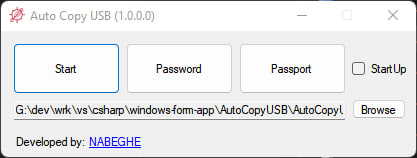

# AutoCopyUSB
>  😈 When a USB Drive (like flash drive) is connected to the computer, This program automatically copies all its contents to your computer in the background.

## 🫡 How To Use

1. Run the program.
2. Click on the Start buttonl; Now the app will be hidden.
3. Connect a USB drive like a flash drive. The contents of the flash drive will be copied to a folder called Copies in the path of the program.

### ❔ How to stop the program

When the program is hidden after pressing the Start button, by opening the exe file again, you will be asked for a password, which is equal to 1 by default; And then by entering that password, the operation of the program will be stopped and the main form will be displayed for you.

### ❔ How to change the password

Click on the Password button and enter your new password.

### ❔ What is the Passport button

If you want a USB drive (Like flash drive) not to be copied when connecting, clicking this button will create a file based on your password. By placing this file in the root of the flash drive, that flash drive will be ignored.

### ❔ What is Startup checkbox

By activating this checkbox, the program will run when Windows starts up.

### ❔ How to change the copies path

Click on the Browse button and choose your custom path.

## 📖 License

Licensed under the MIT license, see [LICENSE.md](LICENSE.md) for details.